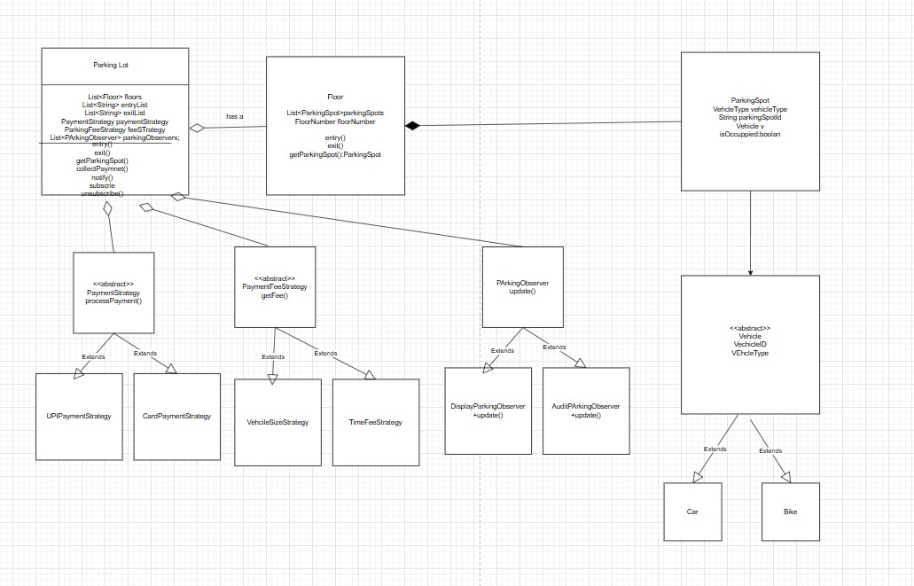

#Designing a Parking Lot System

##Requirements:

1.vehicle will come at entry 
2.Ther would be multiple entry and exist
3.ParkingLot will have have multiple floors.
4.vehicle can be car /bike /truck 
5.there would be sperate spot for each parking vechicle 
6.system will find the parking spot for the vechcle 
7.at time of exit ,user can pay the payment 
8.parking spot will become empty after the exit 
9.we can notify user after the exit 
10.we can have multiple parking strategy for the spot identification and payment strategy for cas/ card payment 

##UML Class Diagram 

##Implementation
